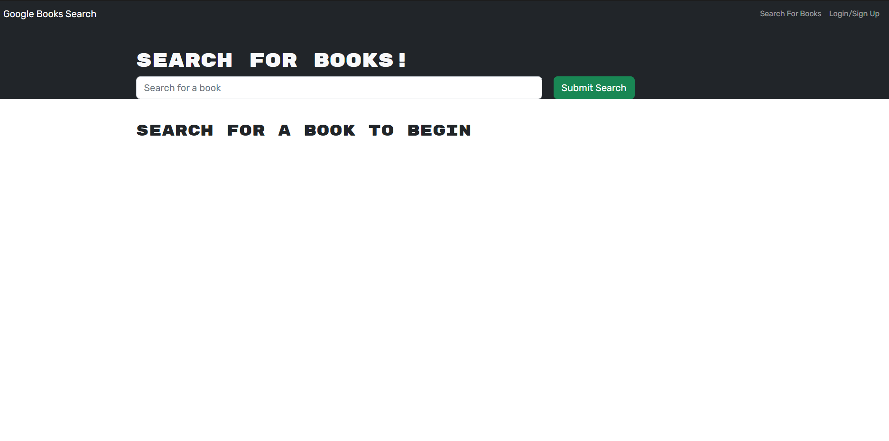
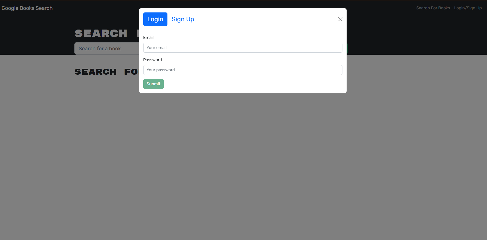
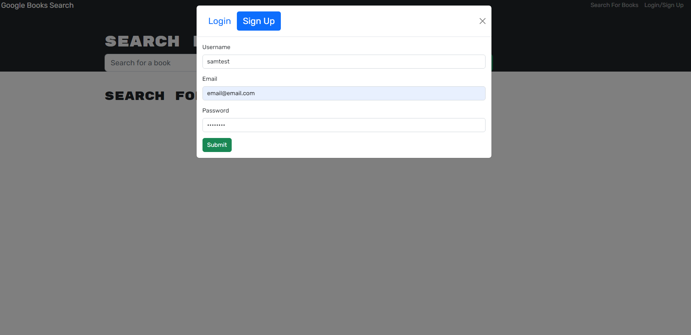
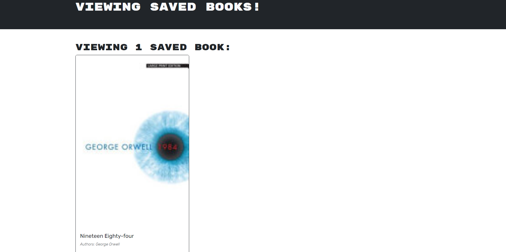

# Booke Search Engine

## DESCRIPTION

- This project is a website that lets the user search for and save books to their profile. It uses the google books API so that the user can search for, add, and delete books from their personal reading list. It also uses mongodb to store the user profiles and their list of books.

## TABLE OF CONTENTS

* [Install](#install)

* [Usage](#usage)

* [license](#license)

* [Questions](#questions)

## INSTALLATION

- Currently you can view the application by going to its deployment at `https://sb-book-search-engine.herokuapp.com`. Otherwise you can view it locally by downloading the application from github at `https://github.com/SBarsuhn/book-search-engine`. From there open a terminal in the root directory and type `npm i` to download the dependencies. After that type `npm run develop` to open the application locally.

## USAGE

- Start by making an account with the signup button in the header. Enter your information and click submit. once you are logged in you can search for a book. When you have found one that you want to add to your account click on the save button. You can check what books you have on your list by clicking on the "see your books" tab in the header. If you want to remove a book from your account click on the "delete this book" button in your profile.

## LICENSE

- This project was licensed under MIT license

## Questions

- If you have any questions please feel free to contact me on github.

- Github Profile: https://github.com/SBarsuhn
